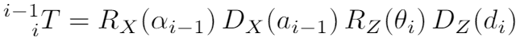

[](https://www.udacity.com/robotics)
# Robotic arm - Pick & Place project

## Implementation write up
### Project description

This project uses simulator of Anthropomorphic Manipulator (RRR). Here is a highlevel representation of such type of manipulator:


The particular implementation of the manipulator is the Kuka KR210 robot:


### Kinematic Analysis

Implementation described below could be found in `kuka_arm/scripts/IK_server.py` file.

#### DH table
The `kuka_arm/urdf/kr210.urdf.xacro` file was evaluated to perform kinematic analysis of Kuka KR210 robot and derive its DH parameters ([Denavit–Hartenberg parameters](https://en.wikipedia.org/wiki/Denavit%E2%80%93Hartenberg_parameters)) represented in the table below:

Links | α<sub>i-1</sub> | a<sub>i-1</sub> | d<sub>i</sub> |        θ<sub>i</sub>
  --- |             --- |             --- |           --- |        ---
 0->1 |               0 |               0 |          0.75 |        θ<sub>1</sub>
 1->2 |            -π/2 |            0.35 |             0 | -π/2 + θ<sub>2</sub>
 2->3 |               0 |            1.25 |             0 |        θ<sub>3</sub>
 3->4 |            -π/2 |          -0.054 |           1.5 |        θ<sub>4</sub>
 4->5 |             π/2 |               0 |             0 |        θ<sub>5</sub>
 5->6 |            -π/2 |               0 |             0 |        θ<sub>6</sub>
6->EE |               0 |               0 |         0.303 |        0

The DH table uses the following 4 parameters:

- *α<sub>i-1</sub>* - twist angle - angle between the *Z<sub>i-1</sub>* and *Z<sub>i</sub>* axes.
- *a<sub>i-1</sub>* - link length - distance between the *Z<sub>i-1</sub>* and *Z<sub>i</sub>* axes.
- *d<sub>i</sub>* - link offset - distance between the *X<sub>i-1</sub>* and *X<sub>i</sub>* axes.
- *θ<sub>i</sub>* - joint angle - angle between the *X<sub>i-1</sub>* and *X<sub>i</sub>* axes.

Here is the visual representation of corresponding robot parameters:


#### Individual transformation matrices

Individual transformation matrices for each joint were built Based on the DH table using equation for the total transform between adjacent links:


which is composed of four individual transforms, 2 rotations and 2 translations, performed in the next order:



A complete homogeneous transform between the `base_link` and the `gripper_link` (end-effector) using just the end-effector pose (position+rotation) consists of a rotation part and a translation part as follows:


where *P<sub>x</sub>*, *P<sub>y</sub>*, *P<sub>z</sub>* represent the position of end-effector w.r.t. `base_link` and *R<sub>T</sub>* represent the rotation part. *R<sub>T</sub>* can be constructed using the Roll-Pitch-Yaw angles of the end-effector (which will be provided from the simulator).

### Inverse Kinematics
Since the last three joints in our robot are revolute and their joint axes intersect at a single point, we have a case of **spherical wrist** with `joint_5` being the common intersection point and hence the wrist center (WC).

This allows us to kinematically decouple the IK problem into Inverse Position and Inverse Orientation.

#### Inverse Position Kinematics

Since we have the case of a **spherical wrist** involving `joints 4,5,6`, the position of the **wrist center** is governed by the first three joints. We can obtain the position of the wrist center by using the complete transformation matrix we derived in the previous section based on the end-effector pose.

For the sake of simplification, let us symbolically define our homogeneous transform as following:


where *l*, *m* and *n* are orthonormal vectors representing the end-effector orientation along *X*, *Y*, *Z* axes of the local coordinate frame.

Since *n* is the vector along the *z*-axis of the `gripper_link`, we can say the following:


where,
- *P<sub>x</sub>*, *P<sub>y</sub>*, *P<sub>z</sub>* - end-effector positions
- *W<sub>x</sub>*, *W<sub>y</sub>*, *W<sub>z</sub>* - wrist positions
- *d<sub>6</sub>* - from DH table
- *l* - end-effector length

The resulting rotational matrix could be obtained by using *x-y-z* extrinsic rotations convention for [Euler angles](https://en.wikipedia.org/wiki/Euler_angles):

`Rrpy = Rot(Z, yaw) * Rot(Y, pitch) * Rot(X, roll) * R_corr`

where `R_corr` is correctional rotation matrix required to address differences between DH-convention and URDF frame assignments:


*n<sub>x</sub>*, *n<sub>y</sub>*, and *n<sub>z</sub>* values may be derived from the `Rrpy` matrix to obtain the wrist center position.

After that values of *θ<sub>1</sub>*, *θ<sub>2</sub>* and *θ<sub>3</sub>* may be calculated.


Even simplified final equations looks rather complicated:

- `θ1 = atan2(wcy, wcx)`
- `θ2 = pi/2 - acos(((sqrt(wcx**2 + wcy**2) - a12)**2 + (wcz - d01)**2 + a23**2 - d34**2 + a34**2) / (a23 * sqrt((sqrt(wcx**2 + wcy**2) - a12)**2 + (wcz - d01)**2) * 2)) - atan2(wcz - d01, sqrt(wcx**2 + wcy**2) - a12)`
- `θ3 = pi/2 - acos((d34**2 + a34**2 + a23**2 - (sqrt(wcx**2 + wcy**2) - a12)**2 + (wcz - d01)**2) / (sqrt(d34**2 + a34**2) * a23 * 2)) - atan2(-a34, d34)`

#### Inverse Orientation Kinematics

Using the individual DH transforms we can obtain the resultant transform and hence resultant rotation by:

`R0_6 = R0_1 * R1_2 * R2_3 * R3_4 * R4_5 * R5_6`

Since the overall RPY (**R**oll **P**itch **Y**aw) rotation between `base_link` and `gripper_link` must be equal to the product of individual rotations between respective links, following holds true:

`R0_6 = Rrpy`

We can substitute the values we calculated for joints 1 to 3 in their respective individual rotation matrices and pre-multiply both sides of the above equation by `inv(R0_3)` which leads to:

`R3_6 = inv(R0_3) * Rrpy`

Final values of *θ<sub>4</sub>*, *θ<sub>5</sub>* and *θ<sub>6</sub>* may be calculated like this:

- `θ4 = atan2(R3_6[2,2], -R3_6[0,2])`
- `θ5 = atan2(sqrt(R3_6[0, 2]**2 + R3_6[2, 2]**2), R3_6[1, 2])`
- `θ6 = atan2(-R3_6[1,1],R3_6[1,0])`

### Project Implementation

The result implementation shows quite decent performance. Most of time kuka arm able to transfer object from the shelf to the basket. From time to time gripper is not able to rigidly grasp object and it may fall down in the middle of movement. But this rarely happens and the issue is beyond the current project scope.

As of further improvements, it's definitely worth to simplify calculations made in the code. Some simplifications were made in pursuit of performance, but this lead to convoluted code. The real impact of such "improvements" need to be evaluated by a standalone benchmark.

## Prerequisites

Make sure you are using [robo-nd VM](https://s3-us-west-1.amazonaws.com/udacity-robotics/Virtual+Machines/Lubuntu_071917/RoboVM_V2.1.0.zip) (password is `robo-nd`) or have Ubuntu+ROS installed locally.

### One time Gazebo setup step:
Check the version of gazebo installed on your system using a terminal:
```sh
$ gazebo --version
```
To run projects from this repository you need version 7.7.0+
If your gazebo version is not 7.7.0+, perform the update as follows:
```sh
$ sudo sh -c 'echo "deb http://packages.osrfoundation.org/gazebo/ubuntu-stable `lsb_release -cs` main" > /etc/apt/sources.list.d/gazebo-stable.list'
$ wget http://packages.osrfoundation.org/gazebo.key -O - | sudo apt-key add -
$ sudo apt-get update
$ sudo apt-get install gazebo7
```

Once again check if the correct version was installed:
```sh
$ gazebo --version
```
### For the rest of this setup, catkin_ws is the name of active ROS Workspace, if your workspace name is different, change the commands accordingly

If you do not have an active ROS workspace, you can create one by:
```sh
$ mkdir -p ~/catkin_ws/src
$ cd ~/catkin_ws/
$ catkin_make
```

Now that you have a workspace, clone or download this repo into the **src** directory of your workspace:
```sh
$ cd ~/catkin_ws/src
$ git clone https://github.com/xCASx/udacity-nd209_robotics.git
```

Now from a terminal window:

```sh
$ cd ~/catkin_ws
$ rosdep install --from-paths src --ignore-src --rosdistro=kinetic -y
$ cd ~/catkin_ws/src/udacity-nd209_robotics/project-2_Robotic_arm_pick_and_place/kuka_arm/scripts
$ sudo chmod +x target_spawn.py
$ sudo chmod +x IK_server.py
$ sudo chmod +x safe_spawner.sh
```
Build the project:
```sh
$ cd ~/catkin_ws
$ catkin_make
```

Add following to your .bashrc file
```
export GAZEBO_MODEL_PATH=~/catkin_ws/src/udacity-nd209_robotics/project-2_Robotic_arm_pick_and_place/kuka_arm/models

source ~/catkin_ws/devel/setup.bash
```

For demo mode make sure the **demo** flag is set to _"true"_ in `inverse_kinematics.launch` file under /udacity-nd209_robotics/project-2_Robotic_arm_pick_and_place/kuka_arm/launch

In addition, you can also control the spawn location of the target object in the shelf. To do this, modify the **spawn_location** argument in `target_description.launch` file under /udacity-nd209_robotics/project-2_Robotic_arm_pick_and_place/kuka_arm/launch. 0-9 are valid values for spawn_location with 0 being random mode.

You can launch the project by
```sh
$ cd ~/catkin_ws/src/udacity-nd209_robotics/project-2_Robotic_arm_pick_and_place/kuka_arm/scripts
$ ./safe_spawner.sh
```

If you are running in demo mode, this is all you need. To run your own Inverse Kinematics code change the **demo** flag described above to _"false"_ and run your code (once the project has successfully loaded) by:
```sh
$ cd ~/catkin_ws/src/udacity-nd209_robotics/project-2_Robotic_arm_pick_and_place/kuka_arm/scripts
$ rosrun kuka_arm IK_server.py
```
Once Gazebo and rviz are up and running, make sure you see following in the gazebo world:

	- Robot
	
	- Shelf
	
	- Blue cylindrical target in one of the shelves
	
	- Dropbox right next to the robot


Once all these items are confirmed, open rviz window, hit Next button.

To view the complete demo keep hitting Next after previous action is completed successfully. 

Since debugging is enabled, you should be able to see diagnostic output on various terminals that have popped up.

The demo ends when the robot arm reaches at the top of the drop location.

In case the demo fails, close all three terminal windows and rerun the script.