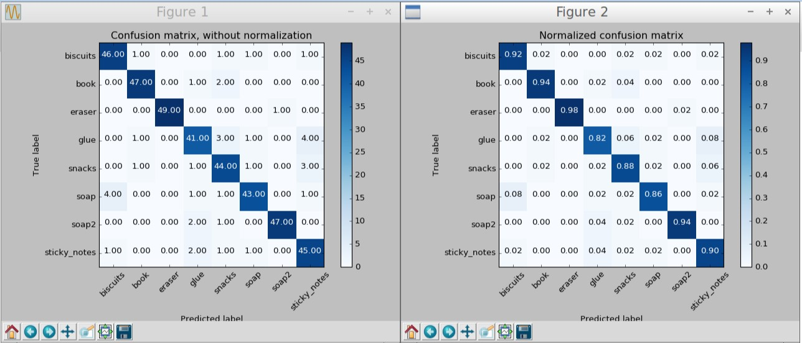

[](https://www.udacity.com/robotics)
# 3D Perception
## Write Up
Logic for object recognition is in `pr2_robot/scripts/object_detector.py` file.

### SVM Model
[SVM model](https://en.wikipedia.org/wiki/Support-vector_machine) was trained based on bunch of point cloud results obtained for each particular object (50 random poses per objct).

Confusion Matrix of trained model:



### ROS Node Setup
First of all ROS node initialized, subscriber and publishers created, and trained SVM model loaded from the disk.

The subscriber subscribes to `/pr2/world/points` topic, where point cloud data published and calls `pcl_callback` method for processing received data.

### Voxel Grid Downsampling
Apply [Voxel Grid Downsampling](http://pointclouds.org/documentation/tutorials/voxel_grid.php) to reduce amount of processable points.

```python
vox = pclMsg.make_voxel_grid_filter()
LEAF_SIZE = 0.005
vox.set_leaf_size(LEAF_SIZE, LEAF_SIZE, LEAF_SIZE)
cloud_filtered = vox.filter()
```

### Noice Reduction
Apply [StatisticalOutlierRemoval Filter](http://pointclouds.org/documentation/tutorials/statistical_outlier.php) to get rid of noise.

```python
outlier_filter = cloud_filtered.make_statistical_outlier_filter()
outlier_filter.set_mean_k(3)
x = 0.05
outlier_filter.set_std_dev_mul_thresh(x)
cloud_filtered = outlier_filter.filter()
```

### PassThrough Filter
Apply [PassThrough Filter](http://pointclouds.org/documentation/tutorials/passthrough.php) to reduce operational space.

```python
passthrough = cloud_filtered.make_passthrough_filter()
filter_axis = 'z'
passthrough.set_filter_field_name(filter_axis)
axis_min = 0.5
axis_max = 0.8
passthrough.set_filter_limits(axis_min, axis_max)
cloud_filtered = passthrough.filter()
```

### Euclidean Clustering (DBSCAN)
Apply Euclidean Clustering ([DBSCAN](https://en.wikipedia.org/wiki/DBSCAN)) algorithm to separate point clouds of different objects.

```python
white_cloud = XYZRGB_to_XYZ(pcl_cloud_objects)
tree = white_cloud.make_kdtree()
ec = white_cloud.make_EuclideanClusterExtraction()
ec.set_ClusterTolerance(0.05)
ec.set_MinClusterSize(50)
ec.set_MaxClusterSize(10000)
ec.set_SearchMethod(tree)
cluster_indices = ec.Extract()
```

### RANSAC Plane Segmentation
Apply [RANSAC](https://en.wikipedia.org/wiki/Random_sample_consensus) Plane Segmentation to separate table and object point clouds.

```python
seg = cloud_filtered.make_segmenter()
seg.set_model_type(pcl.SACMODEL_PLANE)
seg.set_method_type(pcl.SAC_RANSAC)
max_distance = 0.01
seg.set_distance_threshold(max_distance)
inliers, coefficients = seg.segment()
```

### Cluster-Mask Point Cloud
Create Cluster-Mask Point Cloud to visualize each cluster separately

```python
cluster_color = get_color_list(len(cluster_indices))
color_cluster_point_list = []
for j, indices in enumerate(cluster_indices):
    for i, indice in enumerate(indices):
        color_cluster_point_list.append([white_cloud[indice][0],
                                         white_cloud[indice][1],
                                         white_cloud[indice][2],
                                         rgb_to_float(cluster_color[j])])
cluster_cloud = pcl.PointCloud_PointXYZRGB()
cluster_cloud.from_list(color_cluster_point_list)
```

### Object Classification
For every point cloud obtained as a result of clustering operation, run prediction based on pre-trained SVM model to identify particular object.

```python
pcl_cluster = pcl_cloud_objects.extract(pts_list)
ros_cluster = pcl_to_ros(pcl_cluster)

chists = compute_color_histograms(ros_cluster, using_hsv=True)
normals = get_normals(ros_cluster)
nhists = compute_normal_histograms(normals)
feature = np.concatenate((chists, nhists))

prediction = clf.predict(scaler.transform(feature.reshape(1,-1)))
label = encoder.inverse_transform(prediction)[0]
detected_objects_labels.append(label)
```

### Pick and Place
The list of the detected objects passed then to `pr2_mover` method, which determines next action based on pre-defined ordered list `pr2_robot/config/pick_list_*.yaml` which is configured in `pr2_robot/launch/pick_place_project.launch`

```xml
<rosparam command="load" file="$(find pr2_robot)/config/pick_list_3.yaml"/>
```

The corresponding world should be properly defined in the same file as well:

```xml
<arg name="world_name" value="$(find pr2_robot)/worlds/test3.world"/>
```

#### Calculate object centroid

```python
object_name.data = str(object.label)
points_arr = ros_to_pcl(object.cloud).to_array()
centroid = np.mean(points_arr, axis=0)[:3]
```

#### Assign the arm and define place pose

```python
object_idx = object_names.index(object.label)
if object_groups[object_idx] == 'green':
    arm_name.data = 'right'
    position = dropbox_param[1]['position']
else:
    arm_name.data = 'left'
    position = dropbox_param[0]['position']
place_pose.position.x = position[0]
place_pose.position.y = position[1]
place_pose.position.z = position[2]
```

The last part would be either apply pick and place operation based on calculated data, or simply write intermediate results to output yaml files for algorithm evaluation.

## Further improvements

- model quality could be increased to gain 100% correctness of recognition
- quality of pick and place actions may be improved by properly calculating collision point cloud by excluding target object from complete point cloud


## Demo

Demonstration of dynamic object recognition (click to open youtube video):

[](https://www.youtube.com/watch?v=biqNLDdZsEI "3D Perception in Action")

## Project Setup
For this setup, catkin_ws is the name of active ROS Workspace, if your workspace name is different, change the commands accordingly
If you do not have an active ROS workspace, you can create one by:

```sh
$ mkdir -p ~/catkin_ws/src
$ cd ~/catkin_ws/
$ catkin_make
```

Now that you have a workspace, clone or download this repo into the src directory of your workspace:
```sh
$ cd ~/catkin_ws/src
$ git clone https://github.com/udacity/RoboND-Perception-Project.git
```
### Note: If you have the Kinematics Pick and Place project in the same ROS Workspace as this project, please remove the 'gazebo_grasp_plugin' directory from the `RoboND-Perception-Project/` directory otherwise ignore this note. 

Now install missing dependencies using rosdep install:
```sh
$ cd ~/catkin_ws
$ rosdep install --from-paths src --ignore-src --rosdistro=kinetic -y
```
Build the project:
```sh
$ cd ~/catkin_ws
$ catkin_make
```
Add following to your .bashrc file
```
export GAZEBO_MODEL_PATH=~/catkin_ws/src/RoboND-Perception-Project/pr2_robot/models:$GAZEBO_MODEL_PATH
```

If you haven’t already, following line can be added to your .bashrc to auto-source all new terminals
```
source ~/catkin_ws/devel/setup.bash
```

To run the demo:
```sh
$ cd ~/catkin_ws/src/RoboND-Perception-Project/pr2_robot/scripts
$ chmod u+x pr2_safe_spawner.sh
$ ./pr2_safe_spawner.sh
```


Once Gazebo is up and running, make sure you see following in the gazebo world:
- Robot

- Table arrangement

- Three target objects on the table

- Dropboxes on either sides of the robot


If any of these items are missing, please report as an issue on [the waffle board](https://waffle.io/udacity/robotics-nanodegree-issues).

In your RViz window, you should see the robot and a partial collision map displayed:


Proceed through the demo by pressing the ‘Next’ button on the RViz window when a prompt appears in your active terminal

The demo ends when the robot has successfully picked and placed all objects into respective dropboxes (though sometimes the robot gets excited and throws objects across the room!)

Close all active terminal windows using **ctrl+c** before restarting the demo.

You can launch the project scenario like this:
```sh
$ roslaunch pr2_robot pick_place_project.launch
```

For all the step-by-step details on how to complete this project see the [RoboND 3D Perception Project Lesson](https://classroom.udacity.com/nanodegrees/nd209/parts/586e8e81-fc68-4f71-9cab-98ccd4766cfe/modules/e5bfcfbd-3f7d-43fe-8248-0c65d910345a/lessons/e3e5fd8e-2f76-4169-a5bc-5a128d380155/concepts/802deabb-7dbb-46be-bf21-6cb0a39a1961)
Note: The robot is a bit moody at times and might leave objects on the table or fling them across the room :D
As long as your pipeline performs succesful recognition, your project will be considered successful even if the robot feels otherwise!
