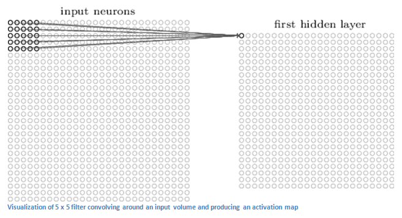

[](https://www.udacity.com/robotics)

# Follow Me: Deep Learning Project

In this project, you will train a deep neural network to identify and track a target in simulation. So-called “follow me” applications like this are key to many fields of robotics and the very same techniques you apply here could be extended to scenarios like advanced cruise control in autonomous vehicles or human-robot collaboration in industry.

[image_0]: ./docs/misc/sim_screenshot.png
![alt text][image_0] 

## Write Up

### Intro

This project uses a kind of [Convolutional Neural Network (CNN)](https://en.wikipedia.org/wiki/Convolutional_neural_network) called [Fully Convoluted Network (FCN)](https://towardsdatascience.com/review-fcn-semantic-segmentation-eb8c9b50d2d1).
The convolutional networks became explosively popular after success of [AlexNet](https://papers.nips.cc/paper/4824-imagenet-classification-with-deep-convolutional-neural-networks.pdf) in task of image recognition.

Probably the biggest advantage which convolutional networks give us is weigths sharing. It is so important because model trained with shared weights become indefferent to location of objects on images. Weigths sharing achieved by learning on small samples of input data at a time. Like a sliding spotlight reveals objects in darkness piece by piece, so called filter (or kernel) convolving small patches of input data and producing an activation map.



CNN consists of a few convolute layers which end up with a fully connected layer. Shallow convolute layers are able to extract very basic information about image like lines or simple shapes, while deeper layers use information from shallow ones to recognize more complex objects (animals, vehicles, human faces etc).

Example of data learned by first and following layers:


CNN ends up with fully connected layer (traditional MLP) with resulting Soft Max activation function, which gives probabilities  per each class of classification. These probabilities could be used to gain confidence of object presence.


FCN is a modification of CNN which allows not only say that object is present (or not) on the picture, but also detect where exactly it is. Classic CNN can't provide this information due to limitations of its fully connected layer, which loses spatial information. To overcome this issue FCN uses Upsampling Via Deconvolution. In general it repeats architecture of convolutional layers in opposite order, which preserves spatial data allowing to use it for picture segmentation.


One important feature of FCN is 1x1 convolutional layer, which is a bridge between encoders (conv layers) and decoders (deconv layers). It allows to increase depth of FCN without introducing more layers.


Additional power of convolutional network is that [trained models could be reused](https://medium.com/infosimples/speed-up-your-deep-learning-projects-with-pre-trained-neural-networks-8ab1aba4e3a3) for different tasks. As shallow layers of convolutional networks learn basic features like lines and shapes it doesn't matter what kind of object we want to recognize at later stages, would it be a hot dog, or a vehicle. So weights of shallow layers could be effectively reused for different recognition tasks.

### Network parameters
Main set of tunable parameters:
- Architecture
    - amount of separable convolutional layers in decoder block
    - amount of encoder and decoder blocks
- Hyperparameters
    - learning rate
    - batch size
    - num epochs
    - steps per epoch
    - validation steps
    - workers

Tuning was done in *sophisticated brute force* way. Different parameter combinations investigated. Usually not more that one parameter was changed at once.

Final network architecture:


### Network Tuning
#### First iteration: baseline
I decided to start with pretty simple initial network setup to create a baseline for network performance ([IoU score](https://en.wikipedia.org/wiki/Jaccard_index)):

Single convolutional layer in decoder block, 2 paris of decoders/encoders of 32/64 depth and single 1x1 convulutional layer of depth 64 between them. Actually, it appeared to be a pretty nice guess.

I increased amount of workers, which should improve learning speed on powerful hardware. Other hyper parameters are:

- learning rate = 0.005
    - I decided to start with small value to see how the model converges
- batch size = 64
    - again small enough value to get started with
- num epochs = 20
    - I didn't want to do way too many epochs just to find out that the network performs poorly, so this parameter was choosen to be small enough and among the last ones to be adjusted
- steps per epoch = 50
    - reduced to increase learning speed at the expense of model quality
- validation steps = 50
    - used recommended value

The resulting score **0.3060**

Pretty far from our goal of 0.4 at least. There is definitely room for improvement!

#### Second iteration: batch size
Batching is a way to deal with lack of memory to load all training data. The more memory you machine has, the bigger should be batch size. It could significantly impact model quality as it is in fact amount of data model sees in a single iteration.

The batch size was increased 64 => 128 and it immediately paid off.

The resulting score **0.4150**

Wow! A single hyperparameter change impacted model quality drastically and the goal of 0.4 was beaten.

#### Third iteration: learning rate
The goal was achieved, but let's see if we can do better.

Learning rate is a multiplicator, which controls how much calculated error affects weights and biases on each backpropagation step. General rule of thumb is to start with small learning rate and try to increase it to see if network is able to converge faster. As network converges the learning rate should be proportinally decreased to avoid overshooting of gradient descent.

In this network [Adam optimizer](https://keras.io/optimizers/) is used. It is responsible for learning rate adjustments during network training, so we don't need to do it manually, but initial value of learning rate may still have impact, so I've tried to reduce it.

The learning rate was increased 0.005 => 0.01, which lead to insignificant improvement.

The resulting score **0.4173**

#### Forth iteration: 1x1 convolution layer adjustment
FCN's 1x1 convolution layers used instead of fully connected layers of classic CNNs help model to gain spatial information. Fully connected layers aren't able to preserve this information. They are able to tell us if object is present on the picture, but can't tell where it exactly is. Deeper 1x1 conv layers potentially able to pass more spatial information (increase the image depth). Let's increase the layer's depth and see how it impact the model quality.

Depth of 1x1 convolution layer increased 64 => 128, the model quality dropped and the change was rolled back.

The resulting score **0.4087**

#### Fifth iteration: one more separable conv layer per decoder block
In this network [Depthwise Separable Convolution Layers](https://towardsdatascience.com/a-basic-introduction-to-separable-convolutions-b99ec3102728) with [Batch Normalization](https://towardsdatascience.com/batch-normalization-in-neural-networks-1ac91516821c) used. Batch normalization responsible for normalizing inputs in hidden layers of network, which deals with fading away activations. Depthwise Separable Convolution Layers analyze separate color channels of image with different conv layers: depthwise and pointwise. They do less multiplications comparing to classic convolution layers, which improves learning speed.
Let's see how amount of separable conv layers in decoders impact model quality.

One more separable conv layer per decoder block was added. The model quality dropped.

The resulting score **0.4063**

Separable Convolution Layers helps to improve speed of learning and in this case there is no gain in using additional layer, as the network is not so big.

#### Sixth iteration: bigger network
Neither deeper 1x1 conv layer, nor additional separable conv layers worked, but we tried them separately. Let's see how previous architecture will perform in case of bigger network.

Depth of second layer of encoders/decoders increased 64 => 128, depth of 1x1 conv layer increased 64 => 512. Result is significant drop of model quality.

The resulting score **0.3363**

Increase in network complexity lead to model quality drop. Either more fine tuning of hyperparameters or more training data required to reveal this architecture power. In any case more shallow network shows decent results and could be trained faster, so let's focus on it.

#### Seventh iteration: epochs and steps per epoch
The third iteration shows the best performance, so let's move forward with this setup and finally play with number of epochs and steps per epoch. These parameters impact how many times we're going through training data and which share of data is used at each epoch. In general we want more data, so let's increase both parameters and see the impact. Another evidence: both training and validation loss continued to reduce till the last epoch, so maybe we just didn't finish model training.

Number of epochs increased 20 => 50, steps per epoch increased 50 => 200

The resulting score **0.4482**

### Conclusions
The initial network architecture was a pretty nice choice. Baseline network consisted of 2 encoder/decoder layers of depth 32/64 and 1x1 convolutional layer in between with depth of 64. Decoder layers contained single separable conv layer each. This network showed resulting score of 0.3060, which was a good starting point, but not enough to beat the goal of 0.4 score.

Neither of changes made to the network architecture paid off. Score values degraded and both learning time and model size increased. The reason may be not the issue with particular network architecture itself, but bad hyperparameters or lack of training data. It's probably worth to increase amount of epochs and steps per epoch to re-evaluate deeper and wider architectures.

The batch size change had the biggest impact on model quality. Adjustments of learning rate improved model insignificantly. It means that initial guess was good enough and Adam optimizer works well without additional tuning. The resulting score after these improvements increased to 0.4173.

As assumed, amount of epochs and steps per epoch parameters helped to improve the best model further. The resulting score after these improvements increased to **0.4482**. I've decided to stop my experiments here for now.

Winner model convergence:


### Future Enhancements
- Adam optimizer adjustment or different optimizers (ADAMAX, NADAM, etc.)
    - learning rate is one of core hyperparameters of network and different optimizers may lead to better network convergence
- Collect more training data
    - for sure amount of quality [data is the key](https://static.googleusercontent.com/media/research.google.com/en//pubs/archive/35179.pdf) to model training; more data need to be collected to reveal power of deep networks
- Experiment more with bigger networks with more epochs and bigger amount of steps per epoch
    - there were too few experiments with deeper networks to make any meaningful conclusions of their effectivenes; more experiments with network architecture needed
- Try more layers of encoders/decoders
    - one way to improve quality of model may be usage of deeper network

### Demo

[](https://www.youtube.com/watch?v=7iFf2zvbFg8 "Follow Me")

## Setup Instructions
**Clone the repository**
```
$ git clone https://github.com/udacity/RoboND-DeepLearning.git
```

**Download the data**

Save the following three files into the data folder of the cloned repository. 

[Training Data](https://s3-us-west-1.amazonaws.com/udacity-robotics/Deep+Learning+Data/Lab/train.zip) 

[Validation Data](https://s3-us-west-1.amazonaws.com/udacity-robotics/Deep+Learning+Data/Lab/validation.zip)

[Sample Evaluation Data](https://s3-us-west-1.amazonaws.com/udacity-robotics/Deep+Learning+Data/Project/sample_evaluation_data.zip)

**Download the QuadSim binary**

To interface your neural net with the QuadSim simulator, you must use a version QuadSim that has been custom tailored for this project. The previous version that you might have used for the Controls lab will not work.

The simulator binary can be downloaded [here](https://github.com/udacity/RoboND-DeepLearning/releases/latest)

**Install Dependencies**

You'll need Python 3 and Jupyter Notebooks installed to do this project.  The best way to get setup with these if you are not already is to use Anaconda following along with the [RoboND-Python-Starterkit](https://github.com/udacity/RoboND-Python-StarterKit).

If for some reason you choose not to use Anaconda, you must install the following frameworks and packages on your system:
* Python 3.x
* Tensorflow 1.2.1
* NumPy 1.11
* SciPy 0.17.0
* eventlet 
* Flask
* h5py
* PIL
* python-socketio
* scikit-image
* transforms3d
* PyQt4/Pyqt5

## Implement the Segmentation Network
1. Download the training dataset from above and extract to the project `data` directory.
2. Implement your solution in model_training.ipynb
3. Train the network locally, or on [AWS](https://classroom.udacity.com/nanodegrees/nd209/parts/09664d24-bdec-4e64-897a-d0f55e177f09/modules/cac27683-d5f4-40b4-82ce-d708de8f5373/lessons/197a058e-44f6-47df-8229-0ce633e0a2d0/concepts/27c73209-5d7b-4284-8315-c0e07a7cd87f?contentVersion=1.0.0&contentLocale=en-us).
4. Continue to experiment with the training data and network until you attain the score you desire.
5. Once you are comfortable with performance on the training dataset, see how it performs in live simulation!

## Collecting Training Data ##
A simple training dataset has been provided in this project's repository. This dataset will allow you to verify that your segmentation network is semi-functional. However, if your interested in improving your score,you may want to collect additional training data. To do it, please see the following steps.

The data directory is organized as follows:
```
data/runs - contains the results of prediction runs
data/train/images - contains images for the training set
data/train/masks - contains masked (labeled) images for the training set
data/validation/images - contains images for the validation set
data/validation/masks - contains masked (labeled) images for the validation set
data/weights - contains trained TensorFlow models

data/raw_sim_data/train/run1
data/raw_sim_data/validation/run1
```

### Training Set ###
1. Run QuadSim
2. Click the `DL Training` button
3. Set patrol points, path points, and spawn points. **TODO** add link to data collection doc
3. With the simulator running, press "r" to begin recording.
4. In the file selection menu navigate to the `data/raw_sim_data/train/run1` directory
5. **optional** to speed up data collection, press "9" (1-9 will slow down collection speed)
6. When you have finished collecting data, hit "r" to stop recording.
7. To reset the simulator, hit "`<esc>`"
8. To collect multiple runs create directories `data/raw_sim_data/train/run2`, `data/raw_sim_data/train/run3` and repeat the above steps.


### Validation Set ###
To collect the validation set, repeat both sets of steps above, except using the directory `data/raw_sim_data/validation` instead rather than `data/raw_sim_data/train`.

### Image Preprocessing ###
Before the network is trained, the images first need to be undergo a preprocessing step. The preprocessing step transforms the depth masks from the sim, into binary masks suitable for training a neural network. It also converts the images from .png to .jpeg to create a reduced sized dataset, suitable for uploading to AWS. 
To run preprocessing:
```
$ python preprocess_ims.py
```
**Note**: If your data is stored as suggested in the steps above, this script should run without error.

**Important Note 1:** 

Running `preprocess_ims.py` does *not* delete files in the processed_data folder. This means if you leave images in processed data and collect a new dataset, some of the data in processed_data will be overwritten some will be left as is. It is recommended to **delete** the train and validation folders inside processed_data(or the entire folder) before running `preprocess_ims.py` with a new set of collected data.

**Important Note 2:**

The notebook, and supporting code assume your data for training/validation is in data/train, and data/validation. After you run `preprocess_ims.py` you will have new `train`, and possibly `validation` folders in the `processed_ims`.
Rename or move `data/train`, and `data/validation`, then move `data/processed_ims/train`, into `data/`, and  `data/processed_ims/validation`also into `data/`

**Important Note 3:**

Merging multiple `train` or `validation` may be difficult, it is recommended that data choices be determined by what you include in `raw_sim_data/train/run1` with possibly many different runs in the directory. You can create a temporary folder in `data/` and store raw run data you don't currently want to use, but that may be useful for later. Choose which `run_x` folders to include in `raw_sim_data/train`, and `raw_sim_data/validation`, then run  `preprocess_ims.py` from within the 'code/' directory to generate your new training and validation sets. 


## Training, Predicting and Scoring ##
With your training and validation data having been generated or downloaded from the above section of this repository, you are free to begin working with the neural net.

**Note**: Training CNNs is a very compute-intensive process. If your system does not have a recent Nvidia graphics card, with [cuDNN](https://developer.nvidia.com/cudnn) and [CUDA](https://developer.nvidia.com/cuda) installed , you may need to perform the training step in the cloud. Instructions for using AWS to train your network in the cloud may be found [here](https://classroom.udacity.com/nanodegrees/nd209/parts/09664d24-bdec-4e64-897a-d0f55e177f09/modules/cac27683-d5f4-40b4-82ce-d708de8f5373/lessons/197a058e-44f6-47df-8229-0ce633e0a2d0/concepts/27c73209-5d7b-4284-8315-c0e07a7cd87f?contentVersion=1.0.0&contentLocale=en-us)

### Training your Model ###
**Prerequisites**
- Training data is in `data` directory
- Validation data is in the `data` directory
- The folders `data/train/images/`, `data/train/masks/`, `data/validation/images/`, and `data/validation/masks/` should exist and contain the appropriate data

To train complete the network definition in the `model_training.ipynb` notebook and then run the training cell with appropriate hyperparameters selected.

After the training run has completed, your model will be stored in the `data/weights` directory as an [HDF5](https://en.wikipedia.org/wiki/Hierarchical_Data_Format) file, and a configuration_weights file. As long as they are both in the same location, things should work. 

**Important Note** the *validation* directory is used to store data that will be used during training to produce the plots of the loss, and help determine when the network is overfitting your data. 

The **sample_evalution_data** directory contains data specifically designed to test the networks performance on the FollowME task. In sample_evaluation data are three directories each generated using a different sampling method. The structure of these directories is exactly the same as `validation`, and `train` datasets provided to you. For instance `patrol_with_targ` contains an `images` and `masks` subdirectory. If you would like to the evaluation code on your `validation` data a copy of the it should be moved into `sample_evaluation_data`, and then the appropriate arguments changed to the function calls in the `model_training.ipynb` notebook.

The notebook has examples of how to evaulate your model once you finish training. Think about the sourcing methods, and how the information provided in the evaluation sections relates to the final score. Then try things out that seem like they may work. 

## Scoring ##

To score the network on the Follow Me task, two types of error are measured. First the intersection over the union for the pixelwise classifications is computed for the target channel. 

In addition to this we determine whether the network detected the target person or not. If more then 3 pixels have probability greater then 0.5 of being the target person then this counts as the network guessing the target is in the image. 

We determine whether the target is actually in the image by whether there are more then 3 pixels containing the target in the label mask. 

Using the above the number of detection true_positives, false positives, false negatives are counted. 

**How the Final score is Calculated**

The final score is the pixelwise `average_IoU*(n_true_positive/(n_true_positive+n_false_positive+n_false_negative))` on data similar to that provided in sample_evaulation_data

**Ideas for Improving your Score**

Collect more data from the sim. Look at the predictions think about what the network is getting wrong, then collect data to counteract this. Or improve your network architecture and hyperparameters. 

**Obtaining a Leaderboard Score**

Share your scores in slack, and keep a tally in a pinned message. Scores should be computed on the sample_evaluation_data. This is for fun, your grade will be determined on unreleased data. If you use the sample_evaluation_data to train the network, it will result in inflated scores, and you will not be able to determine how your network will actually perform when evaluated to determine your grade.

## Experimentation: Testing in Simulation
1. Copy your saved model to the weights directory `data/weights`.
2. Launch the simulator, select "Spawn People", and then click the "Follow Me" button.
3. Run the realtime follower script
```
$ python follower.py my_amazing_model.h5
```

**Note:** If you'd like to see an overlay of the detected region on each camera frame from the drone, simply pass the `--pred_viz` parameter to `follower.py`
